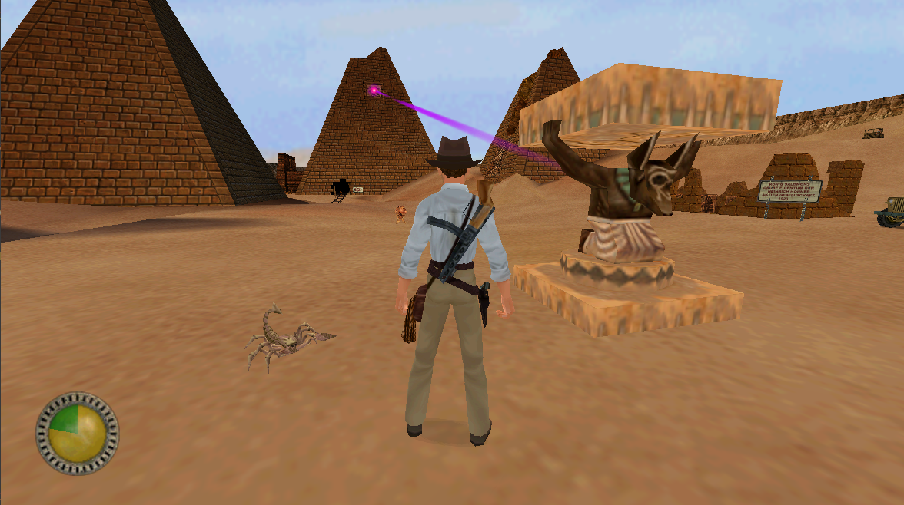

# OpenJones3D



## [Latest Releases](https://github.com/smlu/OpenJones3D/releases)

## Overview

The project is an attempt to recreate the **Jones3D game engine**, originally used in the game *Indiana Jones and the Infernal Machine* (*Indiana Jones und der Turm von Babel*). The project aims to reconstruct the engine function by function in C, based on analyzing the engine executable binary, alongside debug symbols & strings found in the engine, and from insights gained from related game engines such as Sith game engine and its derivatives (e.g., GrimE), and other similar projects like [OpenJKDF2](https://github.com/shinyquagsire23/OpenJKDF2).

This project does ***not*** include any original game assets. A valid copy of the game is required which can be purchased on [Steam](https://store.steampowered.com/app/904540?snr=2_9_100000_) or [GOG](https://www.gog.com/en/game/indiana_jones_and_the_infernal_machine). Additionally, the original CD version of Indy3D.exe version 1.0 is required.

## Running

### Prerequisites
 - Original game assets
 - `Indy3D.exe` version 1.0  
    sha256: `3fbaf8cd401b4af80967cbe42e3420fb803288b336ebbe72a9a01b6dfd661a53`

### Steps:
1. Copy `Jones3D.exe` and `Jones3D.dll` into the `<game-install-folder>\Resource` folder alongside `Indy3D.exe`.
2. Launch `Jones3D.exe`.  
   *Note: If the game is installed in a system-protected directory like *Program Files*, you may need to run `Jones3D.exe` with administrator rights*.

## Building

### Prerequisites
 - Visual Studio 22
 - CMake
 - DirectX 6.1 SDK

### Build Steps
1. Copy the headers and library files of DirectX 6.1 SDK into `Libs\external\DirectX61c\` under `include` and `lib` folders.
2. Navigate into the `Build` folder and use CMake to generate the project for Visual Studio:
   ```bash
   cmake -A win32 -DJONES3D_ENABLE_POST_BUILD_COPY=ON -DJONES3D_POST_BUILD_COPY_DIR="<game-install-folder>\Resource" ..
   ```
   *Note: If copying compiled binaries is not required the 2 extra configuration options can be omitted in.*
3. Build the project.

## High-Level Overview of Engine Architecture
The Jones3D game engine is an upgraded version of the *Sith* game engine, originally used in games like *Star Wars Jedi Knight: Dark Forces II* and *Star Wars Jedi Knight: Mysteries of the Sith*. The engine consists of various modules that do specific tasks, with 8 original modules and 1 module (`j3dcore`) specific to this implementation of the engine.

```
              ┌──────────────────────┐
              │       Jones3D        │
              └──────────────────────┘
                         ▲ 
                         |
              ┌──────────────────────┐
              │         sith         │
              └──────────────────────┘
                         ▲ 
                         |
              ┌──────────────────────┐
              │        rdroid        │
              └──────────────────────┘
                         ▲ 
                         |
 ┌───────────┬───────────┬───────────┬───────────┐
 │   sound   │    std    │  wkernel  │  w32util  │
 └───────────┴───────────┴───────────┴───────────┘
```


#### Lower Layer Modules
 - `w32util` - Windows registry module for interacting with Windows registry
 - `wkernel` - Core module to setup game window and process window-specific events
 - `std` - LEC's standard library module
   - One part consists of general purpose  utility functions such as string copying, file path construction, math, and platform-specific functions, etc...
   - The other part consists of lower-level HAL functions for interacting with hardware: GPU, handling keyboard/mouse inputs, network communication, etc.
 - `sound` - Module implementing sound HAL interface for playing sounds on system sound device

#### Intermediate Layer Modules
 - `rdroid` - The RenderDroid module is the lower level of rendering and rasterization system
   - Builds upon `std` and other lower-level modules
   - Responsible for loading 2D/3D primitives, animations, and textures from files (3DO, spr, key, mat...)
   - Constructs and updates primitives & animations
   - Manages rendering pipeline and drawing primitives to the screen
   - Contains vector and matrix math functions
 - `sith` - The major game's module and the heart of the game system
   - Sits on top of lower and mid-level modules
   - Defines game logic
   - Defines top-layer render pipeline
   - Implements & executes COG script VM
   - Manages game objects (*things*)
   - Handles data serialization and game save logic
   - Defines physics engine
   - Defines collision system
   - Defines camera system
   - Defines AI system

#### Top Layer Module
 - `Jones3D` - Responsible for initiating the game, game flow management, HUD interface, inventory menu, etc.

## Methodology

Most of research is done with reverse engineering tools such as IDA and Ghidra. Some code is identified from other projects such as OpenJKDF2 project, and game engines from other games that uses Sith game engine or are based on that engine such as Grim Fandango. Every function and most of the reconstructed data structures follow the naming conventions found in debug symbols, various text such as logging text and assert text in the engine binary, other related engines and projects. Every function is prefixed by the source code file name (.c) to which it was identified it belongs to, followed by the underscore and function name in pascal case. E.g.: `stdFileUtil_NewFind`, `stdConffile_Open`, `sithThing_AddSwapEntry`. Similar naming convention is used for reconstructed data structures. Additionally canonical source code file names are prefixed by their module name, i.e.  `rd` - RenderDroid, `std` - LEC stdlib, etc.... All code files (.h/c.) are then gathered in the module folders they belong to and put in the canonical file paths found in the game engine. The runtime information such as object address in the engine and function type symbols for each module is placed in the `RTI` folder for the module.

The code implementation is done in four phases:
- 1.) First a shell code is created with thunk functions and references to global variables in the original binary (Indy3D.exe). This allows all functions and variables to be invoked, even if their code has not been implemented yet.
- 2.) Once enough code for specific functions is reconstructed, their thunk representations are replaced with actual implementations. The function hooks are added to ensure the engine calls these implemented functions.
- 3.) After all functions in a specific file are implemented, file-specific static variables are defined, replacing previously defined references to global variables in the original executable. 
- 4.) In the last phase when all references to public global variables in the engine have been implemented, those references are replaced with fully defined extern variables.

The progress is tracked using the `analyze.py` script, which examines the codebase to count the number of "hooked" (implemented) functions.

## Current State

```
Module Progress:
----------------------------------------
rdroid: 100.00% (219/219)
    rdCamera:      100.00% (26/26)
    rdCanvas:      100.00% (3/3)
    rdClip:        100.00% (20/20)
    rdKeyframe:    100.00% (4/4)
    rdLight:       100.00% (4/4)
    rdMaterial:    100.00% (7/7)
    rdPuppet:      100.00% (15/15)
    rdQClip:       100.00% (2/2)
    rdThing:       100.00% (10/10)
    rdroid:        100.00% (10/10)
    rdMath:        100.00% (2/2)
    rdMatrix:      100.00% (25/25)
    rdVector:      100.00% (13/13)
    rdFont:        100.00% (14/14)
    rdModel3:      100.00% (19/19)
    rdParticle:    100.00% (7/7)
    rdPolyline:    100.00% (6/6)
    rdPrimit2:     100.00% (5/5)
    rdPrimit3:     100.00% (2/2)
    rdSprite:      100.00% (3/3)
    rdWallpaper:   100.00% (6/6)
    rdCache:       100.00% (14/14)
    rdFace:        100.00% (2/2)

sith: 45.29% (851/1879)
    sithAI:                  0.00% (0/27)
    sithAIAwareness:         0.00% (0/8)
    sithAIClass:             0.00% (0/12)
    sithAIInstinct:          0.00% (0/29)
    sithAIMove:              0.00% (0/45)
    sithAIUtil:              0.00% (0/53)
    sithCog:               100.00% (48/48)
    sithCogExec:           100.00% (42/42)
    sithCogFunction:       100.00% (133/133)
    sithCogFunctionAI:       0.00% (0/60)
    sithCogFunctionPlayer:   0.00% (0/37)
    sithCogFunctionSector: 100.00% (25/25)
    sithCogFunctionSound:  100.00% (17/17)
    sithCogFunctionSurface:100.00% (38/38)
    sithCogFunctionThing:    0.00% (0/215)
    sithCogParse:            0.00% (0/29)
    sithCogYacc:             0.00% (0/10)
    sithComm:              100.00% (15/15)
    sithConsole:           100.00% (12/12)
    sithControl:           100.00% (24/24)
    sithSound:               0.00% (0/9)
    sithSoundMixer:        100.00% (28/28)
    sithDSS:                 7.69% (2/26)
    sithDSSCog:              0.00% (0/4)
    sithDSSThing:            0.00% (0/39)
    sithGamesave:            3.70% (1/27)
    sithMulti:               0.00% (0/29)
    sithAnimate:             0.00% (0/48)
    sithCamera:             96.15% (25/26)
    sithCollision:         100.00% (27/27)
    sithIntersect:         100.00% (11/11)
    sithParticle:            0.00% (0/13)
    sithPathMove:            0.00% (0/14)
    sithPhysics:             0.00% (0/47)
    sithPuppet:              0.00% (0/54)
    sithRender:            100.00% (22/22)
    sithRenderSky:         100.00% (4/4)
    sithShadow:            100.00% (5/5)
    sithEvent:             100.00% (12/12)
    sithFX:                100.00% (23/23)
    sithInventory:         100.00% (32/32)
    sithOverlayMap:          0.00% (0/21)
    sithPlayer:            100.00% (17/17)
    sithPlayerActions:       0.00% (0/42)
    sithPlayerControls:      0.00% (0/28)
    sithTime:              100.00% (6/6)
    sithVehicleControls:     0.00% (0/17)
    sithWhip:              100.00% (20/20)
    sithCommand:           100.00% (10/10)
    sithMain:              100.00% (30/30)
    sithString:            100.00% (3/3)
    sithActor:             100.00% (12/12)
    sithExplosion:           0.00% (0/7)
    sithItem:              100.00% (5/5)
    sithMaterial:          100.00% (12/12)
    sithModel:             100.00% (17/17)
    sithPVS:               100.00% (4/4)
    sithSector:            100.00% (19/19)
    sithSoundClass:          0.00% (0/24)
    sithSprite:              0.00% (0/15)
    sithSurface:           100.00% (20/20)
    sithTemplate:            0.00% (0/15)
    sithThing:              95.38% (62/65)
    sithVoice:             100.00% (20/20)
    sithWeapon:            100.00% (48/48)
    sithWorld:               0.00% (0/23)

sound: 1.72% (2/116)
    AudioLib:       10.00% (1/10)
    Driver:          0.00% (0/37)
    Sound:           1.45% (1/69)

std: 98.61% (283/287)
    std:           100.00% (17/17)
    stdBmp:        100.00% (2/2)
    stdCircBuf:    100.00% (4/4)
    stdColor:      100.00% (1/1)
    stdConffile:   100.00% (15/15)
    stdEffect:     100.00% (4/4)
    stdFileUtil:   100.00% (5/5)
    stdFnames:     100.00% (6/6)
    stdHashtbl:    100.00% (12/12)
    stdLinkList:   100.00% (2/2)
    stdMath:       100.00% (10/10)
    stdMemory:      63.64% (7/11)
    stdPlatform:   100.00% (10/10)
    stdStrTable:   100.00% (6/6)
    stdUtil:       100.00% (9/9)
    std3D:         100.00% (42/42)
    stdComm:       100.00% (17/17)
    stdConsole:    100.00% (6/6)
    stdControl:    100.00% (37/37)
    stdDisplay:    100.00% (53/53)
    stdGob:        100.00% (13/13)
    stdWin95:      100.00% (5/5)

w32util: 100.00% (10/10)
    wuRegistry:    100.00% (10/10)

wkernel: 100.00% (8/8)
    wkernel:       100.00% (8/8)

Jones3D: 67.46% (255/378)
    jonesConfig:    14.58% (21/144)
    JonesConsole:  100.00% (18/18)
    JonesDisplay:  100.00% (11/11)
    JonesHud:      100.00% (62/62)
    JonesDialog:   100.00% (21/21)
    JonesFile:     100.00% (22/22)
    JonesMain:     100.00% (63/63)
    jonesString:   100.00% (3/3)
    jonesCog:      100.00% (15/15)
    JonesControl:  100.00% (4/4)
    jonesInventory:100.00% (15/15)


Overall Progress: 56.20% | 1628 implemented out of 2897
```